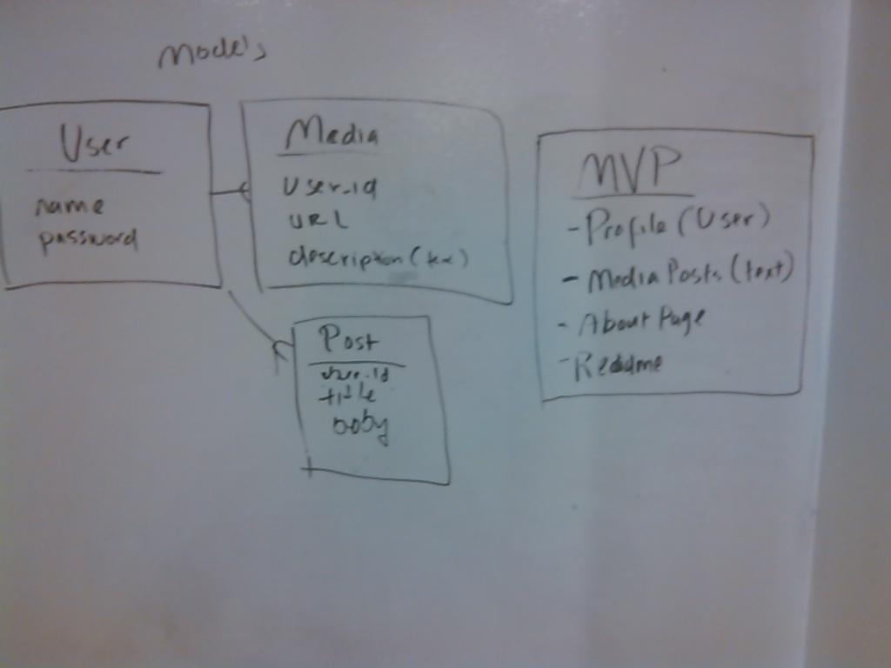

# README

Remember Me

A platform where users can store valuable information about there adventures in life.
Instead of a place cluttered with fake users who take your images and information and exploits it. Remember Me is a safe place to store memories, adventures and also future plans.

User Stories:
1.) A user will be able to sign-up using there google accounts for identity 
2.) They will have enter there preset profile page 
3.) The profile page has options for users to select and use that function of the section 
4.) Options are post, upload images, save locations 

MVP: 
Models 

Things you may want to cover:

* Ruby version

* System dependencies

* Configuration

* Database creation

* Database initialization

* How to run the test suite

* Services (job queues, cache servers, search engines, etc.)

* Deployment instructions

* ...
